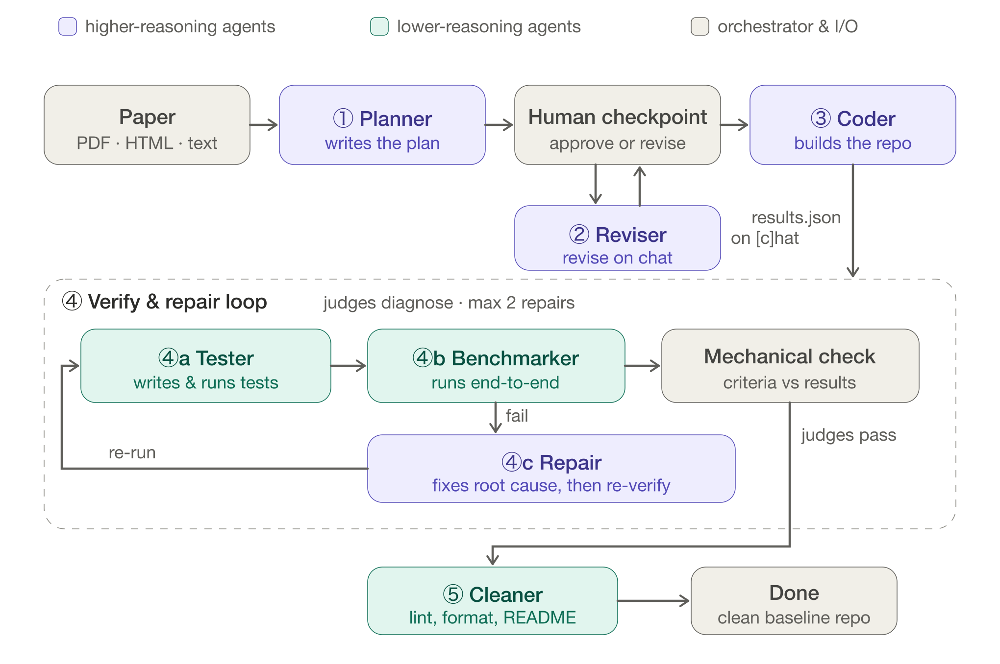

# Benchmark Replicator

[](LICENSE)
[](https://www.python.org/downloads/)
[](https://github.com/Agents4Academia-AI/benchmark-replicator/actions/workflows/ci.yml)

Ever opened a paper's codebase to use, extend, or compare against, and given up
because of how rough, undocumented, or bitrotted it is?

Point this agent at a link to the paper PDF and it builds a clean, minimal,
modular implementation of the method &mdash; code you can actually read, run, and
build on, plus the experiments to reproduce the paper's key results.

## Demo

A timelapse of the agent turning a paper into a clean, runnable baseline repo:

https://github.com/user-attachments/assets/48e06395-4af0-498c-96d2-8922d719a26d

## Installation

Requires Python ≥ 3.10. Install straight from GitHub into a fresh virtual
environment:

```bash
python -m venv .venv && source .venv/bin/activate
pip install "benchmark-replicator[anthropic] @ git+https://github.com/Agents4Academia-AI/benchmark-replicator.git"
```

Swap `anthropic` for whichever provider you want to use:

| Extra | Provider | Env var |
|---|---|---|
| `anthropic` | Anthropic | `ANTHROPIC_API_KEY` |
| `openai` | OpenAI / OpenAI-compatible local servers | `OPENAI_API_KEY` |
| `google` | Google Gemini | `GOOGLE_API_KEY` |
| `ollama` | Ollama (and other local providers) | &mdash; |
| `all` | All of the above | &mdash; |

Then set the API key for your provider (a local Ollama model needs none):

```bash
export ANTHROPIC_API_KEY=...   # or OPENAI_API_KEY / GOOGLE_API_KEY
```

> **Claude subscription users:** if you'd rather use your Claude monthly plan instead of an API key, check out the [`claude-sdk` branch](../../tree/claude-sdk).

## Usage

```bash
replicate https://example.com/paper.pdf   # any PDF URL, or
replicate ./paper.pdf                     # a local PDF
```

Options:

```
--out DIR                output directory (default: replications/<arxiv-id> or replications/pdf-<hash>)
--model MODEL            override the model for all phases (default: opus for plan/code, sonnet otherwise)
--instructions TEXT|FILE extra instructions for the planner: literal text or a path to a file
--yes, -y                auto-approve the plan and run without stopping at the human checkpoint
--gpu                    GPU mode: ships ambitious paper-scale parameters; must be run inside a GPU allocation
```

Use `--instructions` to steer what the planner focuses on before it writes `PLAN.md`:

```bash
replicate https://arxiv.org/abs/1706.03762 --instructions "focus only on scaled dot-product attention, skip multi-head"
replicate https://arxiv.org/abs/1706.03762 --instructions ./my_notes.md
```

> **What to expect:** a full run drives several LLM phases &mdash; a strong model
> for planning and coding, a cheaper one for the rest &mdash; so a single paper
> takes from tens of minutes to about an hour and, on a hosted provider, costs a
> few dollars in API usage. Point `--provider` at a local model (Ollama / vLLM)
> to avoid API cost. The pipeline pauses for your approval of `PLAN.md` before it
> writes any code, so you can stop early if the plan looks wrong.

The generated baseline lands in the output directory &mdash; a standalone repo
with its own `README.md`, `PLAN.md`, `REPORT.md`, source, and tests. The
pipeline runs the **default** config (the real experiment within budget, roughly
tens of minutes to about an hour on a modern CPU); the repo also ships an
optional **scale-up** config for paper-scale runs.

## How it works

A deterministic Python orchestrator (`replicator/pipeline.py`) runs a fixed
sequence of scoped LLM sub-agents &mdash; planner, coder, tester, benchmarker,
repair, and cleaner &mdash; that share state through files in the generated
repo. Each sub-agent is a [LangGraph](https://github.com/langchain-ai/langgraph)
tool-calling agent over the provider you choose via
[LangChain](https://github.com/langchain-ai/langchain)'s `init_chat_model`:
Anthropic (default), OpenAI, Google, or a local model (ollama / llama.cpp /
vLLM). After planning, the pipeline **pauses for your approval** of `PLAN.md`
before any code is written. Pass `--yes` to skip this checkpoint for unattended
runs (e.g. batch jobs on an HPC cluster).



See **[docs/how_it_works.md](docs/how_it_works.md)** for the full pipeline, the
verify-and-repair loop, and an annotated diagram.

## Contributing

Contributions are welcome &mdash; bug reports, provider integrations, prompt
improvements, and docs. See **[CONTRIBUTING.md](CONTRIBUTING.md)** for the dev
setup, how to run the checks, and the PR process, and
[CODE_OF_CONDUCT.md](CODE_OF_CONDUCT.md) for community expectations.

## License

[AGPL-3.0](LICENSE). In short: it's free and open for everyone, and if you
distribute a modified version &mdash; including running it as a network service
&mdash; you must share your changes under the same license.

## Acknowledgements

Built during [Agents4Academia](https://agents4academia.github.io/) at Oxford, 14–26 June 2026.
